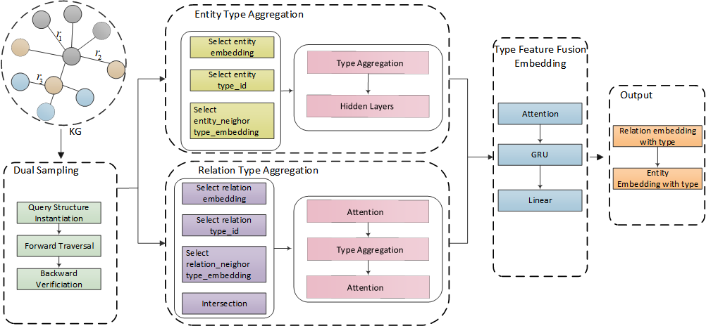

# DSMRT "Dual Sampling strategies and the aggregation of Multi-Relational Type"

  
   

# Dependencies
The dependent version is indicated in the requirment.txt file

# Quick Start
## Clone code 
~~~shell
cd ~/home
git clone https://github.com/Meng831/DSMRT
cd DSMRT
~~~

## Start training
For Generalization:
For example, Take FB15k-237 dataset on GQE :

The script is in GQE_Fb15k-237.sh

For Deductive:
For example, Take FB15k-237 dataset on GQE:

The script is in GQE_Fb15k-237_Ded.sh
